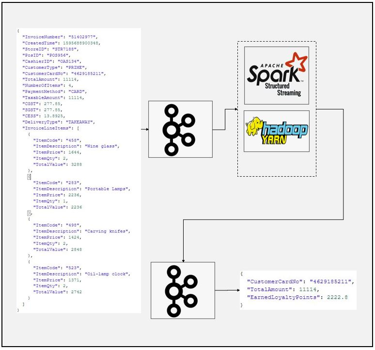

# SparkStream Kafka to Kafka Json Data Example
### Dataflow Pipeline


### Summary

This is kafka source and kafka sink example for spark application. In this example Json sample data (invoice data, see below) published to kafka topics using kafka console producer. Spark streaming application read stream from kafka topics and make some transformations to extract valuable data to calculate customer loyalty points according to transaction fee from the invoice data. Finally transformed data send to another kafka topics. We check results by using kafka console consumer.

```json
{
  "InvoiceNumber": "51402977",
  "CreatedTime": 1595688900348,
  "StoreID": "STR7188",
  "PosID": "POS956",
  "CashierID": "OAS134",
  "CustomerType": "PRIME",
  "CustomerCardNo": "4629185211",
  "TotalAmount": 11114,
  "NumberOfItems": 4,
  "PaymentMethod": "CARD",
  "TaxableAmount": 11114,
  "CGST": 277.85,
  "SGST": 277.85,
  "CESS": 13.8925,
  "DeliveryType": "TAKEAWAY",
  "InvoiceLineItems": [
    {
      "ItemCode": "458",
      "ItemDescription": "Wine glass",
      "ItemPrice": 1644,
      "ItemQty": 2,
      "TotalValue": 3288
    },
    {
      "ItemCode": "283",
      "ItemDescription": "Portable Lamps",
      "ItemPrice": 2236,
      "ItemQty": 1,
      "TotalValue": 2236
    },
    {
      "ItemCode": "498",
      "ItemDescription": "Carving knifes",
      "ItemPrice": 1424,
      "ItemQty": 2,
      "TotalValue": 2848
    },
    {
      "ItemCode": "523",
      "ItemDescription": "Oil-lamp clock",
      "ItemPrice": 1371,
      "ItemQty": 2,
      "TotalValue": 2742
    }
  ]
}
```
### Task List

- [x] Create kafka topics
```
/home/enes/Software/kafka_2.12-2.7.0/bin/kafka-topics.sh --create --zookeeper localhost:2181 --replication-factor 1 --partitions 1 --topic invoices
/home/enes/Software/kafka_2.12-2.7.0/bin/kafka-topics.sh --create --zookeeper localhost:2181 --replication-factor 1 --partitions 1 --topic notifications
```

- [x] Create spark session (You can use ".master("local[*])" instead of yarn if you are running Spark on standalone mode")
```
if __name__ == "__main__":
    spark = SparkSession \
        .builder \
        .appName("Kafka stream") \
        .config("spark.streaming.stop.stopGracefullyOnShutdown", "true") \
        .master("yarn") \
        .getOrCreate()
```
- [x] Define schema
```
#Define schema for invoice data
    schema = StructType([
    StructField("InvoiceNumber", StringType()),
    StructField("CreatedTime", LongType()),
    StructField("StoreID", StringType()),
    StructField("PosID", StringType()),
    StructField("CashierID", StringType()),
    StructField("CustomerType", StringType()),
    StructField("CustomerCardNo", StringType()),
    StructField("TotalAmount", DoubleType()),
    StructField("NumberOfItems", IntegerType()),
    StructField("PaymentMethod", StringType()),
    StructField("CGST", DoubleType()),
    StructField("SGST", DoubleType()),
    StructField("CESS", DoubleType()),
    StructField("DeliveryType", StringType()),
    StructField("DeliveryAddress", StructType([
        StructField("AddressLine", StringType()),
        StructField("City", StringType()),
        StructField("State", StringType()),
        StructField("PinCode", StringType()),
        StructField("ContactNumber", StringType())
    ])),
    StructField("InvoiceLineItems", ArrayType(StructType([
        StructField("ItemCode", StringType()),
        StructField("ItemDescription", StringType()),
        StructField("ItemPrice", DoubleType()),
        StructField("ItemQty", IntegerType()),
        StructField("TotalValue", DoubleType())
    ]))),
])

```
- [x] Read data from kafka topic
```
# very important note: we can change readStream to read if we want to print dataframe at anypoint otherwise streaming data frame can not be shown with .show() method
    kafka_df = spark.readStream \
        .format("kafka") \
        .option("kafka.bootstrap.servers", "localhost:9092") \
        .option("subscribe", "invoices") \
        .option("startingOffsets", "earliest") \
        .load()

```
- [x] Implement transformations
```
#Transfrom data and add new column to calculate loyalty points earned by customer for transaction
    value_df = kafka_df.select(from_json(col("value").cast("string"), schema).alias("value"))
    notification_df = value_df.select("value.InvoiceNumber", "value.CustomerCardNo", "value.TotalAmount") \
    .withColumn("EarnedLoyaltyPoints", expr("TotalAmount*0.2"))

    kafka_target_df = notification_df.selectExpr("InvoiceNumber as key",
                                                 """to_json(named_struct(
                                                 'CustomerCardNo', CustomerCardNo,
                                                 'TotalAmount', TotalAmount,
                                                 'EarnedLoyaltyPoints', TotalAmount * 0.2)) as value""")
```

- [x] Writestream to another kafka topic
```
#Write data into another kafka topics
    notification_writer_query = kafka_target_df \
            .writeStream \
            .queryName("Notification Writer") \
            .format("kafka") \
            .option("kafka.bootstrap.servers", "localhost:9092") \
            .option("topic", "notifications") \
            .outputMode("append") \
            .option("checkpointLocation", "Kafkakafka/chk-point-dir") \
            .start()

    notification_writer_query.awaitTermination()
```

- [x] Start kafka console producer

- [x] Send one sample of data

- [x] Start kafka console consumer

- [x] Check results

### Code Description

kafka2kafka_sparkstream.py is spark script to make desired transformations. Note that in the spark script we are implementing deserialization and serialization when we collect data from kafka and before sending it to the kafka again.

### Running

1. Create kafka topics

2. Start spark job
```
spark-submit --packages org.apache.spark:spark-sql-kafka-0-10_2.12:3.1.1 kafka2kafka_sparkstream.py
```
3. Start kafka producer

4. Send one line of data

5. Start kafka consumer

6. Check result
```json
{
  "CustomerCardNo": "4629185211",
  "TotalAmount": 11114,
  "EarnedLoyaltyPoints": 2222.8
}
```
